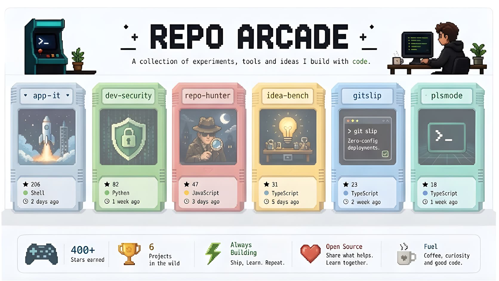
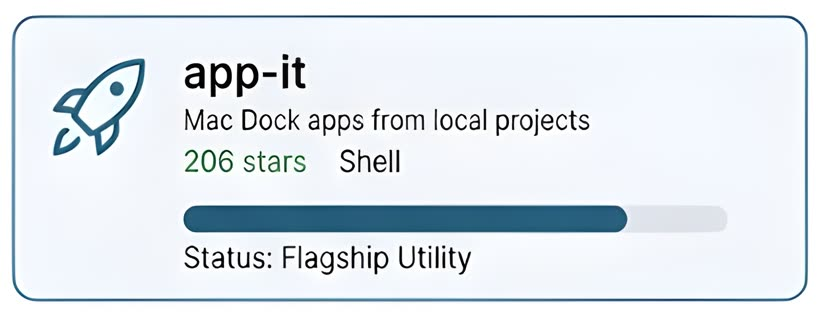
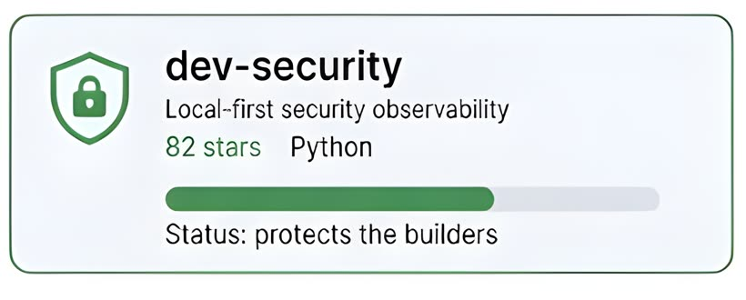
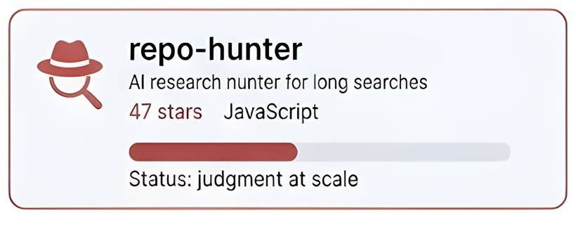
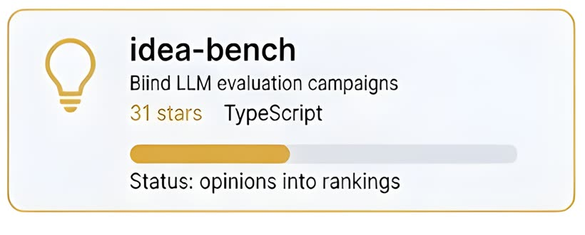
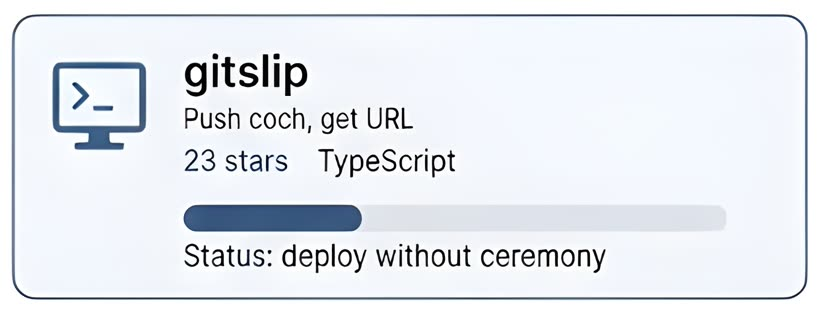
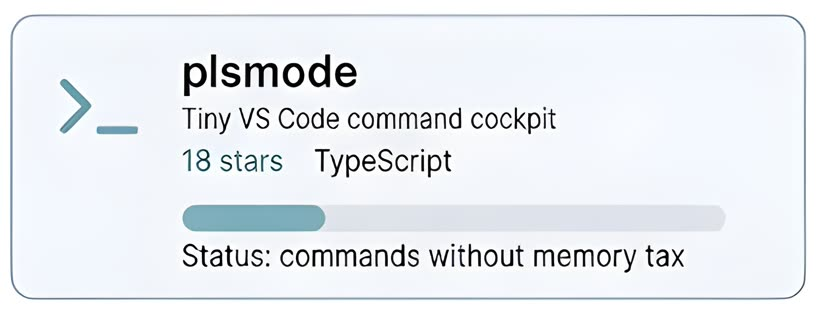

  

  <a href="https://github.com/Christian-Katzmann?tab=repositories">
    <picture>
      <source media="(prefers-color-scheme: dark)" srcset="assets/profile/arcade/hero-dark.jpg">
      <source media="(prefers-color-scheme: light)" srcset="assets/profile/arcade/hero-light.jpg">
      
    </picture>
  </a>

<table>
  <tr>
    <td width="50%">
      <a href="https://github.com/Christian-Katzmann/app-it">
        <picture>
          <source media="(prefers-color-scheme: dark)" srcset="assets/profile/arcade/app-it-dark.jpg">
          <source media="(prefers-color-scheme: light)" srcset="assets/profile/arcade/app-it-light.jpg">
          
        </picture>
      </a>
    </td>
    <td width="50%">
      <a href="https://github.com/Christian-Katzmann/dev-security">
        <picture>
          <source media="(prefers-color-scheme: dark)" srcset="assets/profile/arcade/dev-security-dark.jpg">
          <source media="(prefers-color-scheme: light)" srcset="assets/profile/arcade/dev-security-light.jpg">
          
        </picture>
      </a>
    </td>
  </tr>
  <tr>
    <td width="50%">
      <a href="https://github.com/Christian-Katzmann/repo-hunter">
        <picture>
          <source media="(prefers-color-scheme: dark)" srcset="assets/profile/arcade/repo-hunter-dark.jpg">
          <source media="(prefers-color-scheme: light)" srcset="assets/profile/arcade/repo-hunter-light.jpg">
          
        </picture>
      </a>
    </td>
    <td width="50%">
      <a href="https://github.com/Christian-Katzmann/idea-bench">
        <picture>
          <source media="(prefers-color-scheme: dark)" srcset="assets/profile/arcade/idea-bench-dark.jpg">
          <source media="(prefers-color-scheme: light)" srcset="assets/profile/arcade/idea-bench-light.jpg">
          
        </picture>
      </a>
    </td>
  </tr>
  <tr>
    <td width="50%">
      <a href="https://github.com/Christian-Katzmann/gitslip">
        <picture>
          <source media="(prefers-color-scheme: dark)" srcset="assets/profile/arcade/gitslip-dark.jpg">
          <source media="(prefers-color-scheme: light)" srcset="assets/profile/arcade/gitslip-light.jpg">
          
        </picture>
      </a>
    </td>
    <td width="50%">
      <a href="https://github.com/Christian-Katzmann/plsmode">
        <picture>
          <source media="(prefers-color-scheme: dark)" srcset="assets/profile/arcade/plsmode-dark.jpg">
          <source media="(prefers-color-scheme: light)" srcset="assets/profile/arcade/plsmode-light.jpg">
          
        </picture>
      </a>
    </td>
  </tr>
</table>

## Machine Room

<b>Open the contribution city</b>

  

<b>Open the current operating loop</b>

| Loop | State |
| --- | --- |
| Ship tiny tools | running |
| Turn chaos into systems | running |
| Make AI useful for builders | running |
| Remove cognitive tax | always |

<b>Open contact routes</b>

[Website](https://ktzm.dk) · [LinkedIn](https://www.linkedin.com/in/christiankatzmann/) · [Repositories](https://github.com/Christian-Katzmann?tab=repositories)

