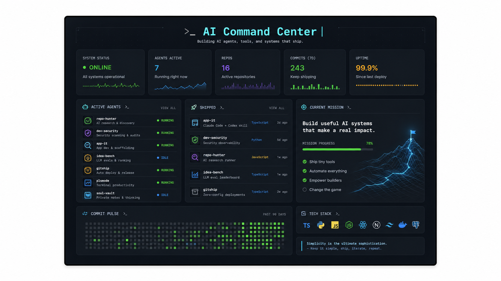
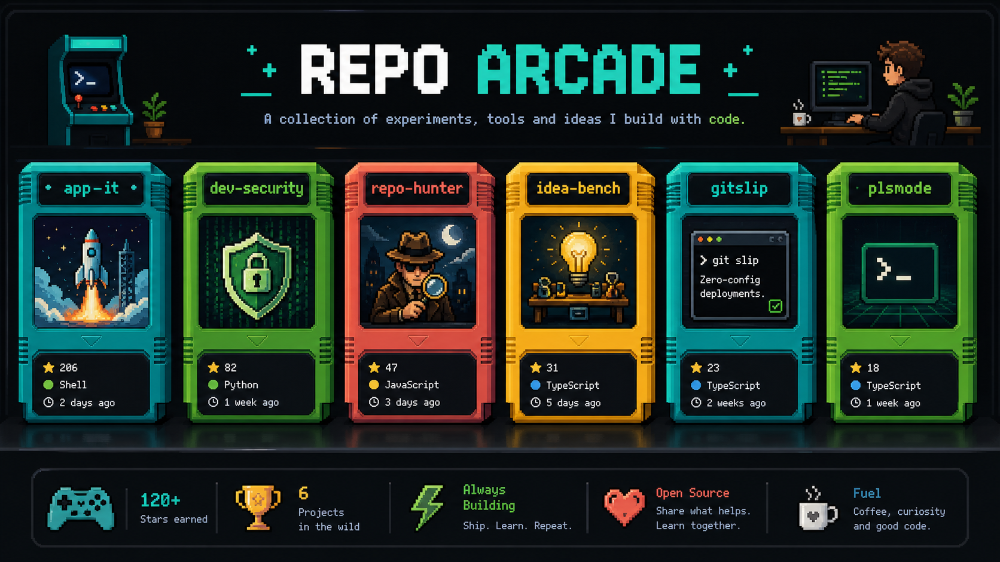
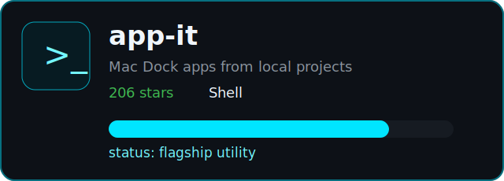
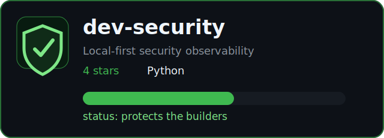
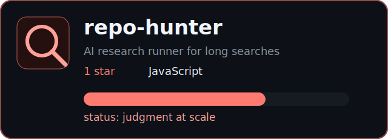
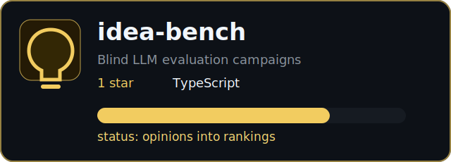
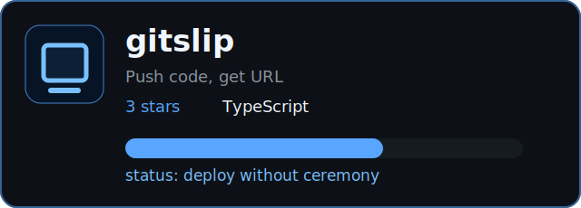
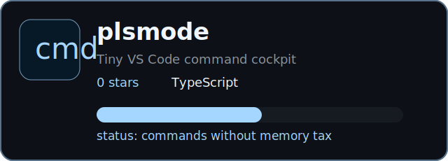
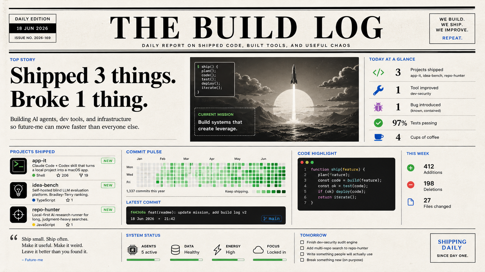

  

  
  
  
  

### Now

Building AI tools, agent workflows, developer infrastructure, and tiny useful systems that remove friction.

  

## Repo Arcade

  

<table>
  <tr>
    <td width="50%">
      
    </td>
    <td width="50%">
      
    </td>
  </tr>
  <tr>
    <td width="50%">
      
    </td>
    <td width="50%">
      
    </td>
  </tr>
  <tr>
    <td width="50%">
      
    </td>
    <td width="50%">
      
    </td>
  </tr>
</table>

## Build Log

  

## Machine Room

<b>Open the contribution city</b>

  

<b>Open the current operating loop</b>

| Loop | State |
| --- | --- |
| Ship tiny tools | running |
| Turn chaos into systems | running |
| Make AI useful for builders | running |
| Remove cognitive tax | always |

<b>Open contact routes</b>

[Website](https://ktzm.dk) · [LinkedIn](https://www.linkedin.com/in/christiankatzmann/) · [Repositories](https://github.com/Christian-Katzmann?tab=repositories)

